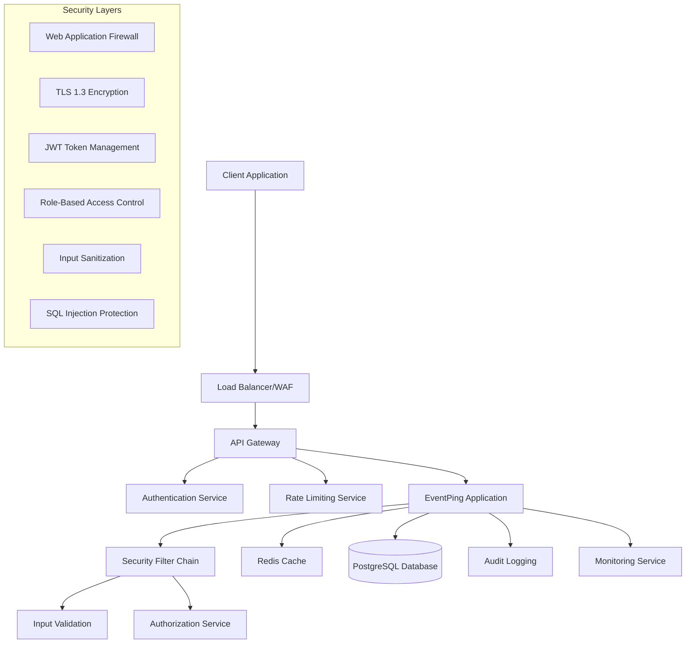

# Design Document: EventPing Security Hardening

## Overview

This design document outlines the comprehensive security hardening and scalability improvements for the EventPing backend application. The current implementation has critical security vulnerabilities including disabled CSRF protection, unrestricted API access, exposed sensitive configuration, and lack of proper authentication. This design addresses these issues through a layered security approach implementing Spring Security, JWT authentication, comprehensive input validation, rate limiting, and production-ready configurations.

The EventPing application is a reminder service that allows users to create events and manage participants with automated notifications. The security hardening will transform it from a development prototype into a production-ready, secure, and scalable application.

## Architecture

### Security Architecture Overview



### Component Architecture

The security hardening introduces several new components and enhances existing ones:

1. **Authentication Service**: JWT-based authentication with refresh token support
2. **Authorization Service**: Role-based access control with resource ownership validation
3. **Rate Limiting Service**: Multi-tier rate limiting with IP-based and user-based limits
4. **Input Validation Service**: Comprehensive validation and sanitization
5. **Audit Logging Service**: Security event logging and monitoring
6. **Configuration Security**: Secure configuration management with environment-based settings

## Components and Interfaces

### 1. Authentication and Authorization Components

#### JWT Authentication Service
```java
@Service
public class JwtAuthenticationService {
    // Generate JWT tokens with proper claims and expiration
    public JwtToken generateToken(User user);
    
    // Validate and parse JWT tokens
    public Claims validateToken(String token);
    
    // Refresh expired tokens
    public JwtToken refreshToken(String refreshToken);
    
    // Blacklist tokens on logout
    public void blacklistToken(String token);
}
```

#### Authorization Service
```java
@Service
public class AuthorizationService {
    // Check if user can access resource
    public boolean canAccessResource(User user, String resourceType, Long resourceId);
    
    // Validate user permissions for specific actions
    public boolean hasPermission(User user, String permission, Object target);
    
    // Check resource ownership
    public boolean isResourceOwner(User user, String resourceType, Long resourceId);
}
```

#### Security Configuration
```java
@Configuration
@EnableWebSecurity
@EnableMethodSecurity
public class SecurityConfig {
    
    @Bean
    public SecurityFilterChain filterChain(HttpSecurity http) throws Exception {
        return http
            .csrf(csrf -> csrf.csrfTokenRepository(CookieCsrfTokenRepository.withHttpOnlyFalse()))
            .sessionManagement(session -> session.sessionCreationPolicy(SessionCreationPolicy.STATELESS))
            .authorizeHttpRequests(auth -> auth
                .requestMatchers("/api/auth/**", "/api/participants/events/*/join").permitAll()
                .requestMatchers("/actuator/health").permitAll()
                .requestMatchers(HttpMethod.GET, "/api/events/*").permitAll()
                .anyRequest().authenticated()
            )
            .oauth2ResourceServer(oauth2 -> oauth2.jwt(Customizer.withDefaults()))
            .addFilterBefore(jwtAuthenticationFilter(), UsernamePasswordAuthenticationFilter.class)
            .addFilterBefore(rateLimitingFilter(), JwtAuthenticationFilter.class)
            .exceptionHandling(ex -> ex
                .authenticationEntryPoint(customAuthenticationEntryPoint())
                .accessDeniedHandler(customAccessDeniedHandler())
            )
            .headers(headers -> headers
                .frameOptions().deny()
                .contentTypeOptions().and()
                .httpStrictTransportSecurity(hsts -> hsts
                    .maxAgeInSeconds(31536000)
                    .includeSubdomains(true)
                )
            )
            .build();
    }
}
```

### 2. Input Validation and Sanitization

#### Input Validation Service
```java
@Service
public class InputValidationService {
    
    // Validate and sanitize user input
    public <T> ValidationResult<T> validateInput(T input, Class<T> type);
    
    // Check for SQL injection patterns
    public boolean containsSqlInjection(String input);
    
    // Check for XSS patterns
    public boolean containsXss(String input);
    
    // Sanitize HTML content
    public String sanitizeHtml(String input);
    
    // Validate email addresses with domain checking
    public boolean isValidEmail(String email);
}
```

#### Custom Validation Annotations
```java
@Target({ElementType.FIELD, ElementType.PARAMETER})
@Retention(RetentionPolicy.RUNTIME)
@Constraint(validatedBy = NoSqlInjectionValidator.class)
public @interface NoSqlInjection {
    String message() default "Input contains potential SQL injection";
    Class<?>[] groups() default {};
    Class<? extends Payload>[] payload() default {};
}

@Target({ElementType.FIELD, ElementType.PARAMETER})
@Retention(RetentionPolicy.RUNTIME)
@Constraint(validatedBy = NoXssValidator.class)
public @interface NoXss {
    String message() default "Input contains potential XSS";
    Class<?>[] groups() default {};
    Class<? extends Payload>[] payload() default {};
}
```

### 3. Rate Limiting Service

#### Rate Limiting Implementation
```java
@Service
public class RateLimitingService {
    
    // Check if request is within rate limits
    public RateLimitResult checkRateLimit(String identifier, RateLimitType type);
    
    // Apply rate limit based on user plan
    public RateLimitResult checkUserRateLimit(User user, String operation);
    
    // Apply IP-based rate limiting
    public RateLimitResult checkIpRateLimit(String ipAddress);
    
    // Block suspicious IPs temporarily
    public void blockIpTemporarily(String ipAddress, Duration duration);
}
```

#### Rate Limiting Filter
```java
@Component
public class RateLimitingFilter implements Filter {
    
    @Override
    public void doFilter(ServletRequest request, ServletResponse response, 
                        FilterChain chain) throws IOException, ServletException {
        
        HttpServletRequest httpRequest = (HttpServletRequest) request;
        String clientIp = getClientIpAddress(httpRequest);
        
        RateLimitResult result = rateLimitingService.checkIpRateLimit(clientIp);
        
        if (!result.isAllowed()) {
            HttpServletResponse httpResponse = (HttpServletResponse) response;
            httpResponse.setStatus(HttpStatus.TOO_MANY_REQUESTS.value());
            httpResponse.setHeader("Retry-After", String.valueOf(result.getRetryAfterSeconds()));
            return;
        }
        
        chain.doFilter(request, response);
    }
}
```

### 4. Enhanced Entity Security

#### User Entity with Security Enhancements
```java
@Entity
@Table(name = "users")
public class User {
    @Id
    @GeneratedValue(strategy = GenerationType.IDENTITY)
    private Long id;

    @Column(nullable = false, unique = true)
    @Email(message = "Invalid email format")
    @NoXss
    private String email;

    @Column(name = "password_hash", nullable = false)
    private String passwordHash;

    @Column(name = "full_name")
    @Size(max = 100, message = "Full name must not exceed 100 characters")
    @NoXss
    private String fullName;

    @Column(name = "phone_number")
    @Pattern(regexp = "^\\+?[1-9]\\d{1,14}$", message = "Invalid phone number format")
    private String phoneNumber;

    @Enumerated(EnumType.STRING)
    @Column(nullable = false)
    private UserRole role = UserRole.USER;

    @Column(name = "account_locked", nullable = false)
    private Boolean accountLocked = false;

    @Column(name = "failed_login_attempts", nullable = false)
    private Integer failedLoginAttempts = 0;

    @Column(name = "last_login_at")
    private LocalDateTime lastLoginAt;

    @Column(name = "created_at", nullable = false)
    private LocalDateTime createdAt = LocalDateTime.now();

    @Column(name = "updated_at", nullable = false)
    private LocalDateTime updatedAt = LocalDateTime.now();

    @PreUpdate
    public void preUpdate() {
        this.updatedAt = LocalDateTime.now();
    }

    public enum UserRole {
        USER, ADMIN, MODERATOR
    }
}
```

#### Event Entity with Security Validations
```java
@Entity
@Table(name = "events")
public class Event {
    @Id
    @GeneratedValue(strategy = GenerationType.IDENTITY)
    private Long id;

    @Column(nullable = false)
    @NotBlank(message = "Event title is required")
    @Size(max = 255, message = "Title must not exceed 255 characters")
    @NoXss
    @NoSqlInjection
    private String title;

    @Column(columnDefinition = "TEXT")
    @Size(max = 5000, message = "Description must not exceed 5000 characters")
    @NoXss
    @NoSqlInjection
    private String description;

    @Column(name = "event_date_time", nullable = false)
    @NotNull(message = "Event date and time is required")
    @Future(message = "Event date must be in the future")
    private LocalDateTime eventDateTime;

    @Enumerated(EnumType.STRING)
    @Column(nullable = false)
    private EventStatus status = EventStatus.ACTIVE;

    @Column(nullable = false, unique = true)
    @Pattern(regexp = "^[a-zA-Z0-9-_]{8,50}$", message = "Invalid slug format")
    private String slug;

    @ManyToOne(fetch = FetchType.LAZY)
    @JoinColumn(name = "creator_id", nullable = false)
    private User creator;

    @Column(name = "max_participants")
    @Min(value = 1, message = "Maximum participants must be at least 1")
    @Max(value = 10000, message = "Maximum participants cannot exceed 10000")
    private Integer maxParticipants;

    @Column(name = "is_public", nullable = false)
    private Boolean isPublic = true;

    @Column(name = "created_at", nullable = false)
    private LocalDateTime createdAt = LocalDateTime.now();

    @PrePersist
    public void prePersist() {
        if (slug == null || slug.isEmpty()) {
            slug = generateSecureSlug();
        }
    }

    private String generateSecureSlug() {
        return UUID.randomUUID().toString().replace("-", "").substring(0, 12);
    }
}
```

### 5. Secure Controllers with Authorization

#### Enhanced User Controller
```java
@RestController
@RequestMapping("/api/users")
@RequiredArgsConstructor
@Validated
public class UserController {
    
    private final UserService userService;
    private final AuthorizationService authorizationService;

    @PostMapping("/register")
    @RateLimit(type = RateLimitType.USER_REGISTRATION, limit = 5, window = "1h")
    public ResponseEntity<UserResponseDto> registerUser(
            @Valid @RequestBody UserRegistrationRequest request,
            HttpServletRequest httpRequest) {
        
        auditLogger.logUserRegistrationAttempt(request.getEmail(), getClientIp(httpRequest));
        UserResponseDto response = userService.registerUser(request);
        
        URI location = ServletUriComponentsBuilder
                .fromCurrentRequest()
                .path("/{id}")
                .buildAndExpand(response.getId())
                .toUri();
        
        return ResponseEntity.created(location).body(response);
    }

    @GetMapping("/{id}")
    @PreAuthorize("@authorizationService.canAccessUser(authentication.principal, #id)")
    public ResponseEntity<UserResponseDto> getUser(@PathVariable Long id) {
        return ResponseEntity.ok(userService.getUserById(id));
    }

    @PutMapping("/{id}")
    @PreAuthorize("@authorizationService.canModifyUser(authentication.principal, #id)")
    public ResponseEntity<UserResponseDto> updateUser(
            @PathVariable Long id,
            @Valid @RequestBody UserUpdateRequest request) {
        
        return ResponseEntity.ok(userService.updateUser(id, request));
    }

    @DeleteMapping("/{id}")
    @PreAuthorize("@authorizationService.canDeleteUser(authentication.principal, #id)")
    public ResponseEntity<Void> deleteUser(@PathVariable Long id) {
        userService.deleteUser(id);
        return ResponseEntity.noContent().build();
    }
}
```

#### Enhanced Event Controller
```java
@RestController
@RequestMapping("/api/events")
@RequiredArgsConstructor
@Validated
public class EventController {
    
    private final EventService eventService;
    private final AuthorizationService authorizationService;
    private final RateLimitingService rateLimitingService;

    @PostMapping
    @PreAuthorize("hasRole('USER')")
    @RateLimit(type = RateLimitType.EVENT_CREATION, limit = 10, window = "1h")
    public ResponseEntity<EventResponseDto> createEvent(
            @Valid @RequestBody CreateEventRequest request,
            Authentication authentication) {
        
        User user = (User) authentication.getPrincipal();
        
        // Check user's plan limits
        if (!eventService.canCreateEvent(user)) {
            throw new RateLimitExceededException("Event creation limit exceeded for your plan");
        }
        
        EventResponseDto event = eventService.createEvent(user, request);
        return ResponseEntity.ok(event);
    }

    @GetMapping("/{slug}")
    public ResponseEntity<EventResponseDto> getEvent(@PathVariable String slug) {
        EventResponseDto event = eventService.getEventBySlug(slug);
        return ResponseEntity.ok(event);
    }

    @PutMapping("/{id}")
    @PreAuthorize("@authorizationService.canModifyEvent(authentication.principal, #id)")
    public ResponseEntity<EventResponseDto> updateEvent(
            @PathVariable Long id,
            @Valid @RequestBody UpdateEventRequest request) {
        
        return ResponseEntity.ok(eventService.updateEvent(id, request));
    }

    @DeleteMapping("/{id}")
    @PreAuthorize("@authorizationService.canDeleteEvent(authentication.principal, #id)")
    public ResponseEntity<Void> deleteEvent(@PathVariable Long id) {
        eventService.deleteEvent(id);
        return ResponseEntity.noContent().build();
    }

    @GetMapping
    @PreAuthorize("hasRole('USER')")
    public ResponseEntity<List<EventResponseDto>> getUserEvents(Authentication authentication) {
        User user = (User) authentication.getPrincipal();
        List<EventResponseDto> events = eventService.getUserEvents(user);
        return ResponseEntity.ok(events);
    }
}
```

### 6. Audit Logging Service

#### Audit Logging Implementation
```java
@Service
@RequiredArgsConstructor
public class AuditLoggingService {
    
    private final AuditEventRepository auditEventRepository;
    private final ObjectMapper objectMapper;

    public void logAuthenticationSuccess(String username, String ipAddress) {
        AuditEvent event = AuditEvent.builder()
            .eventType(AuditEventType.AUTHENTICATION_SUCCESS)
            .username(username)
            .ipAddress(ipAddress)
            .timestamp(LocalDateTime.now())
            .build();
        
        auditEventRepository.save(event);
    }

    public void logAuthenticationFailure(String username, String ipAddress, String reason) {
        AuditEvent event = AuditEvent.builder()
            .eventType(AuditEventType.AUTHENTICATION_FAILURE)
            .username(username)
            .ipAddress(ipAddress)
            .details(Map.of("reason", reason))
            .timestamp(LocalDateTime.now())
            .build();
        
        auditEventRepository.save(event);
    }

    public void logDataModification(String username, String entityType, Long entityId, 
                                  Object oldValue, Object newValue) {
        try {
            Map<String, Object> details = Map.of(
                "entityType", entityType,
                "entityId", entityId,
                "oldValue", objectMapper.writeValueAsString(oldValue),
                "newValue", objectMapper.writeValueAsString(newValue)
            );
            
            AuditEvent event = AuditEvent.builder()
                .eventType(AuditEventType.DATA_MODIFICATION)
                .username(username)
                .details(details)
                .timestamp(LocalDateTime.now())
                .build();
            
            auditEventRepository.save(event);
        } catch (Exception e) {
            log.error("Failed to log data modification", e);
        }
    }

    public void logSecurityViolation(String username, String ipAddress, String violationType, 
                                   String details) {
        AuditEvent event = AuditEvent.builder()
            .eventType(AuditEventType.SECURITY_VIOLATION)
            .username(username)
            .ipAddress(ipAddress)
            .details(Map.of("violationType", violationType, "details", details))
            .timestamp(LocalDateTime.now())
            .severity(AuditSeverity.HIGH)
            .build();
        
        auditEventRepository.save(event);
        
        // Send alert for high-severity events
        alertService.sendSecurityAlert(event);
    }
}
```

## Data Models

### Security-Enhanced Data Models

#### Audit Event Entity
```java
@Entity
@Table(name = "audit_events")
public class AuditEvent {
    @Id
    @GeneratedValue(strategy = GenerationType.IDENTITY)
    private Long id;

    @Enumerated(EnumType.STRING)
    @Column(nullable = false)
    private AuditEventType eventType;

    @Column(name = "username")
    private String username;

    @Column(name = "ip_address")
    private String ipAddress;

    @Column(name = "user_agent")
    private String userAgent;

    @Column(name = "request_uri")
    private String requestUri;

    @Type(JsonType.class)
    @Column(name = "details", columnDefinition = "jsonb")
    private Map<String, Object> details;

    @Enumerated(EnumType.STRING)
    @Column(nullable = false)
    private AuditSeverity severity = AuditSeverity.MEDIUM;

    @Column(name = "timestamp", nullable = false)
    private LocalDateTime timestamp;

    public enum AuditEventType {
        AUTHENTICATION_SUCCESS,
        AUTHENTICATION_FAILURE,
        AUTHORIZATION_FAILURE,
        DATA_MODIFICATION,
        SECURITY_VIOLATION,
        RATE_LIMIT_EXCEEDED,
        SUSPICIOUS_ACTIVITY
    }

    public enum AuditSeverity {
        LOW, MEDIUM, HIGH, CRITICAL
    }
}
```

#### Rate Limit Tracking Entity
```java
@Entity
@Table(name = "rate_limit_tracking")
public class RateLimitTracking {
    @Id
    @GeneratedValue(strategy = GenerationType.IDENTITY)
    private Long id;

    @Column(name = "identifier", nullable = false)
    private String identifier; // IP address or user ID

    @Enumerated(EnumType.STRING)
    @Column(name = "limit_type", nullable = false)
    private RateLimitType limitType;

    @Column(name = "request_count", nullable = false)
    private Integer requestCount = 0;

    @Column(name = "window_start", nullable = false)
    private LocalDateTime windowStart;

    @Column(name = "window_end", nullable = false)
    private LocalDateTime windowEnd;

    @Column(name = "blocked_until")
    private LocalDateTime blockedUntil;

    public enum RateLimitType {
        IP_GLOBAL,
        USER_API,
        USER_REGISTRATION,
        EVENT_CREATION,
        PARTICIPANT_JOIN,
        EMAIL_SENDING
    }
}
```

### Database Security Enhancements

#### Connection Pool Configuration
```java
@Configuration
public class DatabaseConfig {
    
    @Bean
    @ConfigurationProperties("spring.datasource.hikari")
    public HikariConfig hikariConfig() {
        HikariConfig config = new HikariConfig();
        config.setMaximumPoolSize(20);
        config.setMinimumIdle(5);
        config.setConnectionTimeout(30000);
        config.setIdleTimeout(600000);
        config.setMaxLifetime(1800000);
        config.setLeakDetectionThreshold(60000);
        
        // Security settings
        config.addDataSourceProperty("ssl", "true");
        config.addDataSourceProperty("sslmode", "require");
        config.addDataSourceProperty("sslcert", "client-cert.pem");
        config.addDataSourceProperty("sslkey", "client-key.pem");
        config.addDataSourceProperty("sslrootcert", "ca-cert.pem");
        
        return config;
    }
}
```

## Correctness Properties

*A property is a characteristic or behavior that should hold true across all valid executions of a system-essentially, a formal statement about what the system should do. Properties serve as the bridge between human-readable specifications and machine-verifiable correctness guarantees.*

### Property 1: Authentication Token Validity
*For any* JWT token generated by the system, the token should be valid according to the configured signing key and should contain all required claims (user ID, roles, expiration)
**Validates: Requirements 1.2, 1.4**

### Property 2: Authorization Enforcement
*For any* protected resource access attempt, if the user does not have the required permissions or does not own the resource, the system should return HTTP 403 Forbidden
**Validates: Requirements 1.5**

### Property 3: Input Validation Completeness
*For any* user input received by the system, all fields should be validated against their defined constraints and malicious patterns should be detected and rejected
**Validates: Requirements 2.1, 2.2, 2.3, 2.4**

### Property 4: Rate Limiting Enforcement
*For any* sequence of API requests from a single source, when the requests exceed the defined rate limits, the system should return HTTP 429 and block further requests until the rate limit window resets
**Validates: Requirements 3.1, 3.2**

### Property 5: Data Encryption Consistency
*For any* sensitive data stored in the database, the data should be encrypted using the configured encryption algorithm and should be decryptable only with the proper keys
**Validates: Requirements 4.1, 4.3**

### Property 6: Security Headers Presence
*For any* HTTP response sent by the system, all required security headers (HSTS, CSP, X-Frame-Options, etc.) should be present with appropriate values
**Validates: Requirements 5.1, 5.3, 5.5**

### Property 7: Audit Logging Completeness
*For any* security-relevant event (authentication, authorization failure, data modification), an audit log entry should be created with all required fields populated
**Validates: Requirements 6.1, 6.2, 6.3**

### Property 8: SQL Injection Prevention
*For any* database query executed by the system, the query should use parameterized statements and should not contain user input directly concatenated into the SQL string
**Validates: Requirements 7.2**

### Property 9: Error Information Disclosure Prevention
*For any* error that occurs during request processing, the error response returned to the client should not contain sensitive system information, stack traces, or internal implementation details
**Validates: Requirements 8.1, 8.3**

### Property 10: Session Token Security
*For any* user session token, the token should have appropriate expiration times, should be invalidated on logout, and should never be exposed in URLs or logs
**Validates: Requirements 9.1, 9.3, 9.5**

## Error Handling

### Centralized Exception Handling

```java
@RestControllerAdvice
public class GlobalExceptionHandler {

    private final AuditLoggingService auditLoggingService;

    @ExceptionHandler(AuthenticationException.class)
    public ResponseEntity<ErrorResponse> handleAuthenticationException(
            AuthenticationException ex, HttpServletRequest request) {
        
        auditLoggingService.logAuthenticationFailure(
            ex.getAuthentication() != null ? ex.getAuthentication().getName() : "unknown",
            getClientIpAddress(request),
            ex.getMessage()
        );

        ErrorResponse error = ErrorResponse.builder()
            .timestamp(LocalDateTime.now())
            .status(HttpStatus.UNAUTHORIZED.value())
            .error("Authentication Failed")
            .message("Invalid credentials")
            .path(request.getRequestURI())
            .build();

        return ResponseEntity.status(HttpStatus.UNAUTHORIZED).body(error);
    }

    @ExceptionHandler(AccessDeniedException.class)
    public ResponseEntity<ErrorResponse> handleAccessDeniedException(
            AccessDeniedException ex, HttpServletRequest request) {
        
        Authentication auth = SecurityContextHolder.getContext().getAuthentication();
        auditLoggingService.logAuthorizationFailure(
            auth != null ? auth.getName() : "anonymous",
            getClientIpAddress(request),
            request.getRequestURI()
        );

        ErrorResponse error = ErrorResponse.builder()
            .timestamp(LocalDateTime.now())
            .status(HttpStatus.FORBIDDEN.value())
            .error("Access Denied")
            .message("Insufficient permissions")
            .path(request.getRequestURI())
            .build();

        return ResponseEntity.status(HttpStatus.FORBIDDEN).body(error);
    }

    @ExceptionHandler(ValidationException.class)
    public ResponseEntity<ErrorResponse> handleValidationException(
            ValidationException ex, HttpServletRequest request) {
        
        ErrorResponse error = ErrorResponse.builder()
            .timestamp(LocalDateTime.now())
            .status(HttpStatus.BAD_REQUEST.value())
            .error("Validation Failed")
            .message("Invalid input data")
            .validationErrors(ex.getValidationErrors())
            .path(request.getRequestURI())
            .build();

        return ResponseEntity.badRequest().body(error);
    }

    @ExceptionHandler(RateLimitExceededException.class)
    public ResponseEntity<ErrorResponse> handleRateLimitExceededException(
            RateLimitExceededException ex, HttpServletRequest request) {
        
        ErrorResponse error = ErrorResponse.builder()
            .timestamp(LocalDateTime.now())
            .status(HttpStatus.TOO_MANY_REQUESTS.value())
            .error("Rate Limit Exceeded")
            .message("Too many requests. Please try again later.")
            .path(request.getRequestURI())
            .build();

        HttpHeaders headers = new HttpHeaders();
        headers.add("Retry-After", String.valueOf(ex.getRetryAfterSeconds()));

        return ResponseEntity.status(HttpStatus.TOO_MANY_REQUESTS)
            .headers(headers)
            .body(error);
    }

    @ExceptionHandler(Exception.class)
    public ResponseEntity<ErrorResponse> handleGenericException(
            Exception ex, HttpServletRequest request) {
        
        // Log full exception details server-side
        log.error("Unexpected error occurred", ex);
        
        // Return generic error to client
        ErrorResponse error = ErrorResponse.builder()
            .timestamp(LocalDateTime.now())
            .status(HttpStatus.INTERNAL_SERVER_ERROR.value())
            .error("Internal Server Error")
            .message("An unexpected error occurred")
            .path(request.getRequestURI())
            .build();

        return ResponseEntity.status(HttpStatus.INTERNAL_SERVER_ERROR).body(error);
    }
}
```

### Secure Error Response Model

```java
@Data
@Builder
public class ErrorResponse {
    private LocalDateTime timestamp;
    private int status;
    private String error;
    private String message;
    private String path;
    private Map<String, String> validationErrors;
    
    // Never include sensitive information like:
    // - Stack traces
    // - Internal system details
    // - Database connection strings
    // - Configuration values
}
```

## Testing Strategy

### Security Testing Approach

The testing strategy employs both unit tests for specific security components and property-based tests for universal security properties. This dual approach ensures comprehensive coverage of security mechanisms while validating that security properties hold across all possible inputs and scenarios.

#### Unit Testing Focus Areas

1. **Authentication Components**
   - JWT token generation and validation
   - Password hashing and verification
   - Token refresh mechanisms
   - Token blacklisting functionality

2. **Authorization Components**
   - Role-based access control
   - Resource ownership validation
   - Permission checking logic
   - Method-level security annotations

3. **Input Validation**
   - SQL injection detection
   - XSS pattern recognition
   - Email format validation
   - Input sanitization functions

4. **Rate Limiting**
   - Rate limit calculation accuracy
   - Window-based limiting logic
   - IP blocking mechanisms
   - Plan-based quota enforcement

#### Property-Based Testing Configuration

All property-based tests will be implemented using JUnit 5 with the jqwik library for Java property-based testing. Each test will run a minimum of 100 iterations to ensure comprehensive coverage through randomization.

**Property Test Implementation Requirements:**
- Minimum 100 iterations per property test
- Each property test must reference its design document property
- Tag format: **Feature: eventping-security-hardening, Property {number}: {property_text}**
- Tests must validate universal properties across all valid inputs
- Failed tests must provide clear counterexamples for debugging

#### Integration Testing

1. **End-to-End Security Flows**
   - Complete authentication and authorization workflows
   - API security with real HTTP requests
   - Database security with actual connections
   - Rate limiting under concurrent load

2. **Security Integration Points**
   - Spring Security filter chain integration
   - JWT token integration with controllers
   - Audit logging integration with all components
   - Error handling integration across layers

#### Security-Specific Test Categories

1. **Penetration Testing Simulation**
   - Automated security scanning
   - SQL injection attempt simulation
   - XSS attack simulation
   - Authentication bypass attempts

2. **Performance Under Attack**
   - DDoS simulation testing
   - Rate limiting effectiveness under load
   - System stability during security events
   - Resource exhaustion prevention

3. **Configuration Security Testing**
   - Environment variable validation
   - Secret management verification
   - TLS configuration validation
   - Database connection security

The testing strategy ensures that all security mechanisms function correctly individually and work together as a cohesive security system, providing defense in depth against various attack vectors.